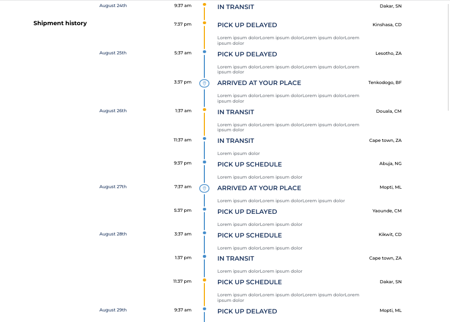
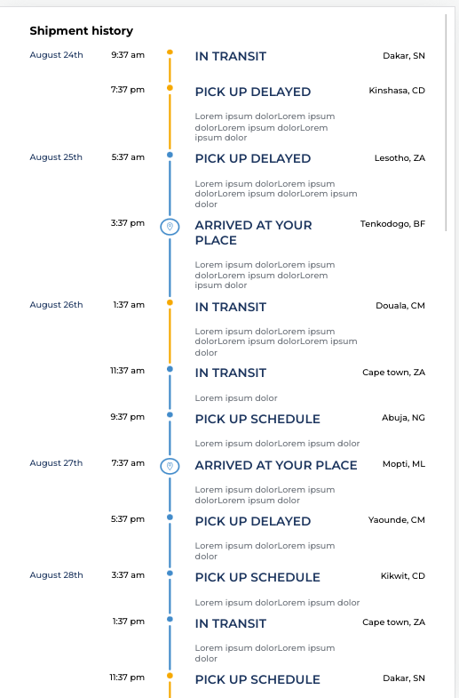
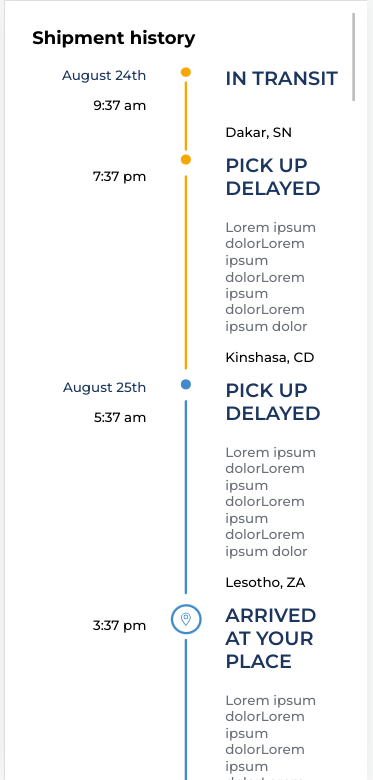

# shipment-history

## Built With

- HTML, CSS & JavaScript

## Authors

👤 **Cedric KOSSI**

- GitHub: [@kosher9](https://github.com/kosher9)
- Twitter: [@kosherus](https://twitter.com/kosherus)
- LinkedIn: [LinkedIn](https://linkedin.com/in/lionel-c%C3%A9dric-kossi-323042172)

## How to run the app

- Clown the project on your computer, run `npm install` and open the `index.html` file in your browser.
- You can change the dataset by copying one from `data` folder and replacing the default one in `shipment.js` file at line 2

## Preview
- 
- 
- 

## 🤝 Contributing

Contributions, issues, and feature requests are welcome!

Feel free to check the [issues page](../../issues/).

## Acknowledgments

- Hat tip to anyone whose code was used
- Inspiration
- etc

## 📝 License

This project is [MIT](./MIT.md) licensed.